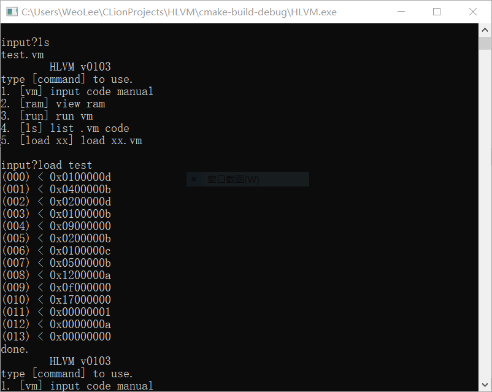
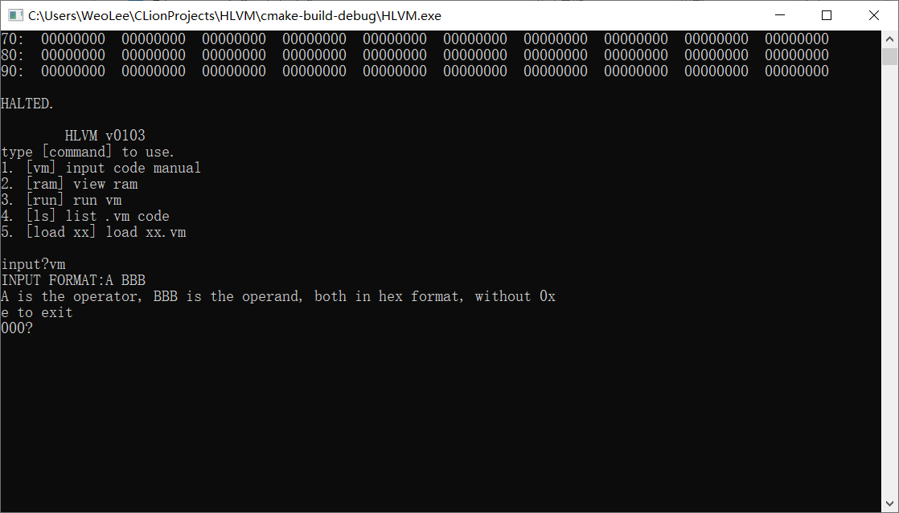
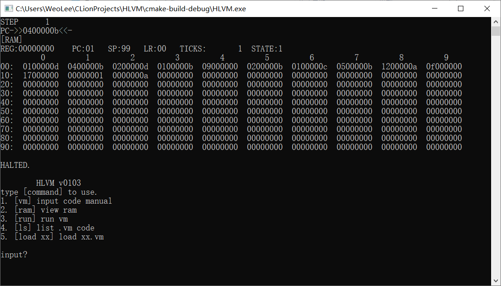
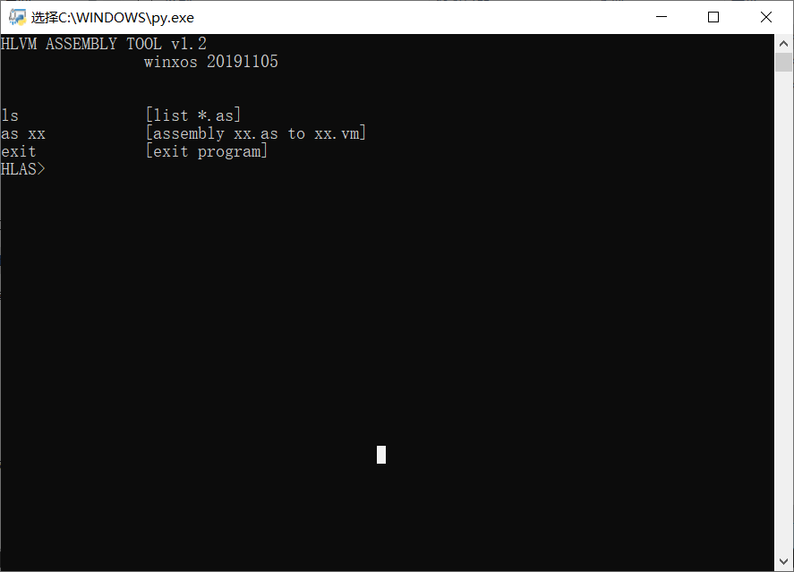
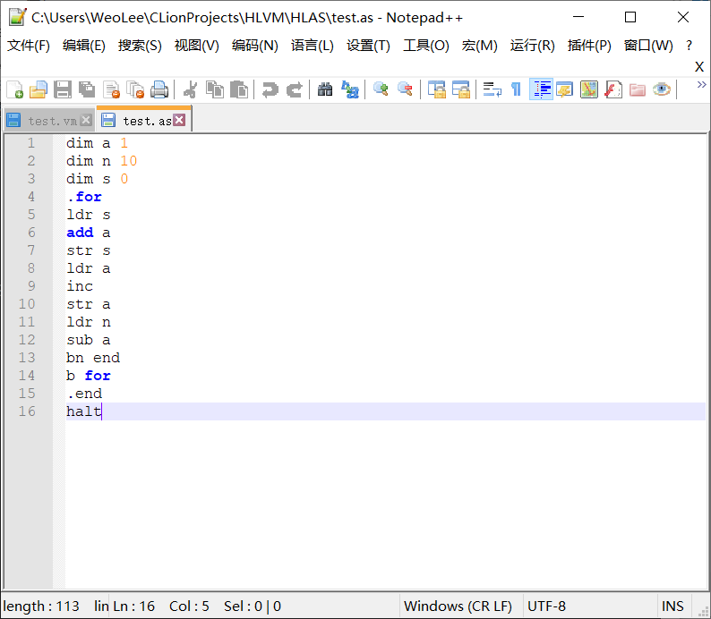
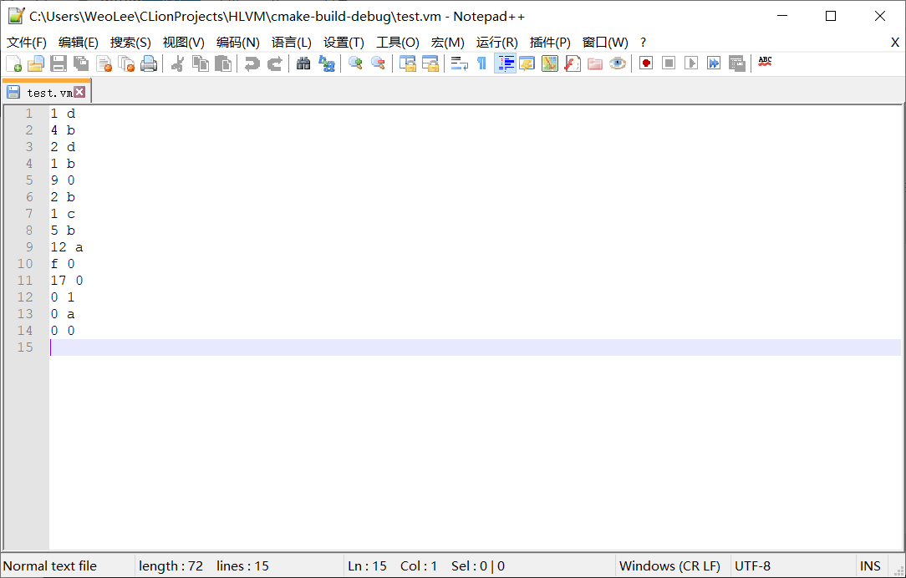

# HLVM
### Introduction

HLVM is an simplest abstract Virtual Machine interpreter implement,

Developed using pure C language under Clion,

The code can transplant to platform such as arduino, cortex-m easily.

### Use Guide

#### HLVM

Project include a shell, can input and run machine code directly also can load machine code in *.vm file








HLVM can display and run the vm code in a different frequency, so you can see the code running directly.

#### HLAS

The folder HLAS provide a assembly tool for HLVM, wrote in python 3.7,  design an assembly language for HLVM, can convert the assembly code from *.as file to *.vm machine code.



Assembly tool.



The assembly language.



The machine code.

#### Instruction set

The machine code length is 32 bits, the first 8 bits is the operator, the rest 24 bits is the operand.

The machine's described below,

``` c
#define MEM_SIZE  100
#define ROM_SIZE  100
#define INTERRUPT_SIZE 10
#define STACK_SIZE 50
struct HLVM{
    u32 _mems[MEM_SIZE];/*memories*/
    void* _interrupts[INTERRUPT_SIZE]; /*soft interrupt*/
    s32 reg;
    u32 pc;/*program counter*/
    u32 sp;/*stack pointer*/
    u32 lr;/*link reg*/
    u32 ticks;/*cpu time*/
    u32 _sleeping;
    HLVM_STATE state;
};
```

The instruction set currently supports the following instructions,

``` python
    "ldr": 0x01,
    "str": 0x02,
    "ldri": 0x03,
    "add": 0x04,
    "sub": 0x05,
    "mul": 0x06,
    "div": 0x07,
    "mod": 0x08,
    "inc": 0x09,
    "dec": 0x0a,
    "neg": 0x0b,
    "and": 0x0c,
    "or": 0x0d,
    "xor": 0x0e,
    "b": 0x0f,
    "bl": 0x10,
    "bz": 0x11,
    "bn": 0x12,
    "int": 0x13,
    "halt": 0x14,
    "push": 0x15,
    "pop": 0x16,
    "slp": 0x17,
    "ret": 0x18,
```

### The End

The virtual machine is very helpful for everyone to understand the operation of the computer. 

Designing and implementing a virtual machine is a great exercise for beginners' programming ability. 

The virtual machine is a very important way to achieve cross-platform code.

A well-designed simple virtual machine can quickly run on ultra-low-profile hardware platforms, such as 8051, arduino, and other microcontrollers. 

This project started several years ago and is mainly used for teaching purposes. 

Due to the limited energy and skills of the author, the implementation is not complete, and will be improved in the future. 

Now I host the code here, hope it will be helpful to everyone.

